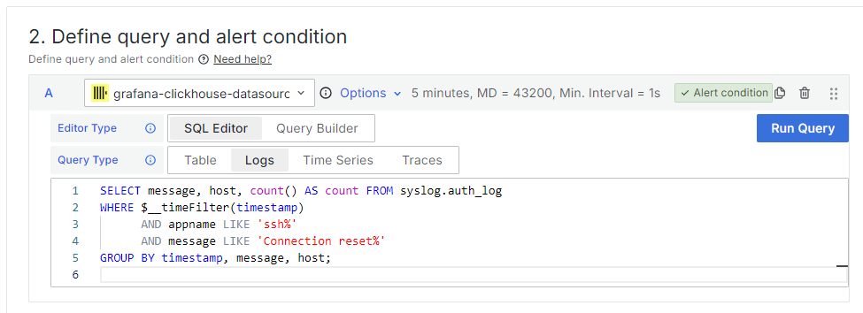
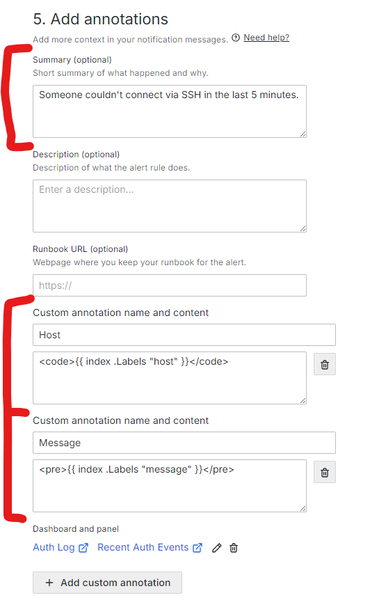
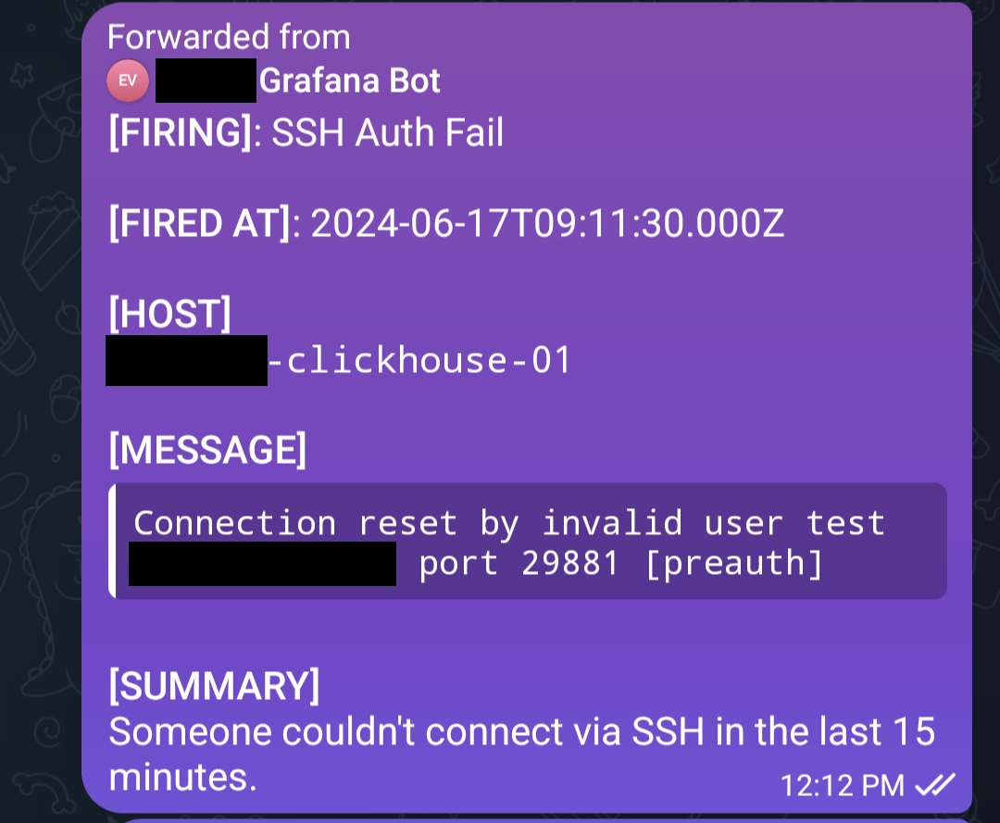
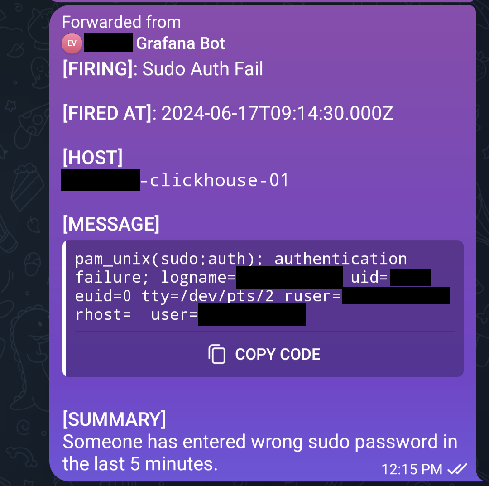
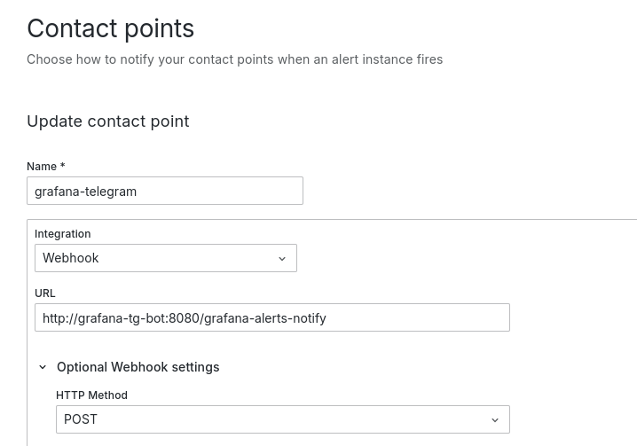

= Send Webhook-based Grafana Alerts via Telegram
:toc:
:toc-title: Contents

WARNING: This is an experimental prototype, a proof of concept. Don't use in production. A lot of things don't work as expected, and extensive testing is still needed.

NOTE: The webhook endpoint doesn't support auth and encryption. If you need HTTPS and auth, use a reverse proxy.

[%collapsible,title=Prerequisites]
====
NOTE: If you are planning to run it in Docker containers, ignore this list. See _Dockerfile_ and _compose.yml_.

- Node.js latest
- Redis-compatible in-memory database (I prefer Valkey)
- pnpm
====

== Features
* Access control based on Telegram UIDs
* Multiple chats can be subscribed simultaneously
* Both private chats and group chats can be subscribed to alerts
+
NOTE: The user interacting with the bot in a group chat must be added to the ACL, but not the group chat itself.
* Unauthorized users are ignored
* Arbitrary messages and unrecognized commands are ignored
* Unauthorized access to valid bot commands is logged
* Grafana interacts with the bot via a webhook endpoint
* Style messages with Telegram-supported HTML tags (the bot doesn't support Markdown)

== Demo
Suppose, you use ClickHouse as a data warehouse for your logs, and it's connected to your Grafana instance as a data source.

You have created an alert rule with the following SQL query:

And annotations look like the following:

When the alert rule is triggered, all subscribed Telegram chats will get messages similar to this:

[%collapsible,title=Another Example for Sudo Alerts]
====

====

[%collapsible,title=Example Video]
====
link:assets/screencast.mp4[]
====

== Build From Source
[,console]
----
$ pnpm build
----

== Configure
. Copy the example configuration file _botconfig.toml_ to a new directory _./config_.
. Edit config.

== Run
NOTE: Don't run using pnpm. It breaks signal handling.

[,console]
----
$ node build/main.js
----

=== Environment
You can set environment variables to change the program's behavior.

|===
|Variable |Used for |Default

|BOTCONFIG
|Change config file path.
a|
[,typescript]
----
`${getProjectRoot()}/config/botconfig.toml`
----
|===

== Reload Config
To reload configuration, send the `SIGHUP` signal to the process.

=== Example 1

[,console]
----
$ pnpm reload
----

=== Example 2

[,console]
----
$ kill -HUP <PID here> # You can use something like $(pidof node) if there's only one Node.js process.
----

== Connect Grafana
. Create a webhook contact point pointing to your bot instance
. Make sure it uses the POST method

== Sub/unsub to Alerts
=== Subscribe
Group Chat::
    Add the bot to a chat just like a regular user, and issue the _/start@bot_name_ command.

Personal Chat::
    Open a chat with the bot, and press the _start_ button.

=== Unsubscribe
Same as above, but the command is _/stop@bot_name_ or _/stop_ depending on the chat type.

== License
link:./LICENSE[0BSD]

== To Do
* Catch Grammy errors
* Make queues reliable
* Send out messages with time represented in a local timezone instead of UTC
* Improve cache error handling, fix infinite frequent retries on wrong user/password
* Improve logging, revert cache connect and disconnect logging
* Improve config validation
